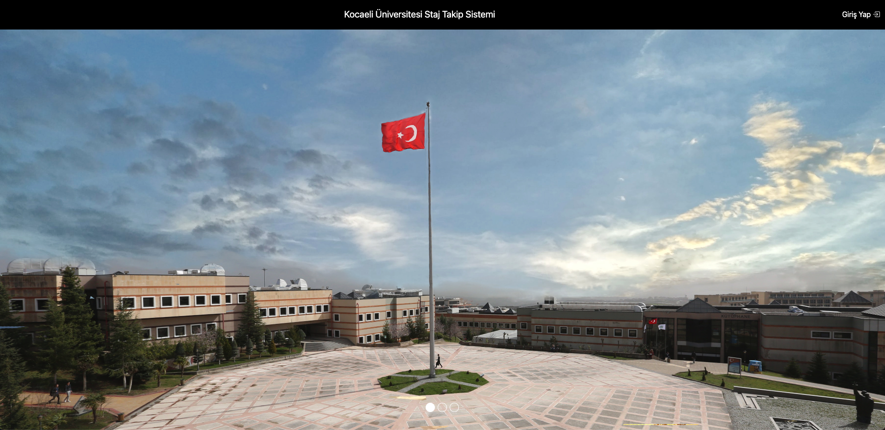

# STAJ TAKİP SİSTEMİ

## ÇALIŞMA AMACI

Proje kapsamında kullanıcı girdilerine bağlı, dinamik olarak doküman (PDF)
oluşturabilen bir sistemin geliştirilmesi beklenmektedir. Kullanıcı bilgileri; staj
başvurusunda talep edilen öğrenci bilgileri, firma bilgileri, açık adres ve iletişim
bilgileridir. Bu bilgilerin kullanılması suretiyle dinamik bir başvuru dokümanı
oluşturulması ve oluşturulan bu doküman üzerinden staj başvuru işlemlerinin
yürütülmesi amaçlanmaktadır. 

Aşağıdaki link üzerinden proje içeriğine ait oluşturulmuş gerekli bilgilendirme metnine ve projenin genel tasarım kalıplarına ulaşabilirsiniz.

Proje bilgilendirme dökümanına ulaşmak için [tıklayınız](https://drive.google.com/file/d/18SocTw9Kop8EgYFbXkPd7h-qSzs0Vm1l/view?usp=share_link)


### Kullanılan Npm Paketleri

- express
- mysql2
- express-session
- sequelize
- nodemailer
- sequelize-auto
- puppeteer
- multer
- html2canvas
- jspdf
- bcrypt
- connect-session-sequelize
- cookie-parser
- ejs
- csurf

### ÇALIŞTIRMA AŞAMALARI

- ````
  npm i  
  ````
  
şeklinde ilgili paketler yüklenmelidir. Ardından proje çalıştırılmalıdır;

- ````
  docker-compose up
  ````

- ````
  node index.js  
  ````

### ÖRNEK KULLANICILAR

Kullanıcı Numara --- Şifre --- ROL ---

 *201307011   ---     erdemhacihasanoğlu          --- Öğrenci
 *2419        ---     serdarsolak                 --- Admin
 *5205        ---     sedabalta                   --- Komisyon
 *7012        ---     alpermetin                  --- Öğretmen

# INTERNSHIP TRACKING SYSTEM

## OBJECTIVE

Within the scope of the project, it is expected to develop a system that can dynamically generate documents (PDF) depending on user inputs. User information includes student information requested in internship applications, company information, full address, and contact information. It is aimed to create a dynamic application document using this information and to conduct internship application procedures through the created document.

You can access the necessary informative text about the project content and the general design patterns of the project via the link below.

To access the project information document, [click here](https://drive.google.com/file/d/18SocTw9Kop8EgYFbXkPd7h-qSzs0Vm1l/view?usp=share_link)